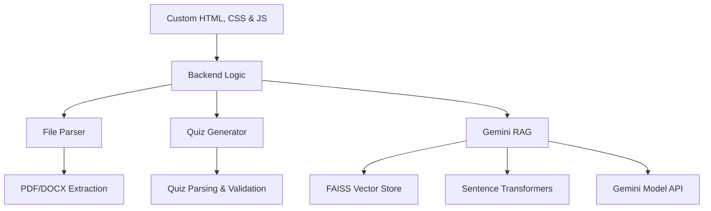

# 📚 LearniFy – Smart Chat & Quiz Generator

<div align="center">
  <h3>Your AI-Powered Learning Companion</h3>
  <p>A AI-based platform that transforms uploaded documents into interactive Q&A sessions and AI-generated quizzes.</p>
  <a href="https://huggingface.co/spaces/Momit-Mahir/learnify" target="_blank"><b>🌐 Live Demo</b></a>
</div>

## 📑 Table of Contents

* [Core Features](#-core-features)
* [System Architecture](#-system-architecture)
* [Workflow](#-workflow)
* [Technical Components](#-technical-components)
* [Setup Guide](#-setup-guide)
* [Usage](#-usage)
* [Troubleshooting](#-troubleshooting)
---

## 🌟 Core Features

### Document Intelligence

* **Multi-format Uploads**

  * PDF and DOCX support
  * Automatic text extraction

* **Context-Aware Chat**

  * Ask questions about your uploaded document
  * Gemini-powered retrieval-augmented generation (RAG)

* **Quiz Generation**

  * AI-generated multiple-choice quizzes
  * Adjustable difficulty (easy, medium, hard)
  * Instant scoring with correct answers highlighted

---

## 🏗 System Architecture



### Backend Stack

* **AI Models**: Gemini 2.5 Flash (Google Generative AI)
* **Vector Store**: FAISS
* **Embeddings**: Sentence Transformers (`all-MiniLM-L6-v2`)
* **File Handling**: PyPDF2, python-docx

---

## 🔄 Workflow

### 1. Document Upload

* User uploads a PDF or DOCX.
* Extracted text is processed and chunked.

### 2. Index Building

* Chunks are embedded using Sentence Transformers.
* FAISS index is built for semantic retrieval.

### 3. Chat System

* User asks a question.
* Relevant chunks are retrieved.
* Gemini model generates an answer.

### 4. Quiz Generation

* User selects quiz length & difficulty.
* Gemini generates MCQs.
* Parsed into structured quiz format.
* User attempts quiz and receives instant feedback.

---

## 🛠 Technical Components

### File Parser

```python
def extract_text_from_pdf(file):
    reader = PdfReader(file)
    return "\n".join([page.extract_text() or '' for page in reader.pages])
```

### Quiz Generator

```python
def generate_quiz(text, num_questions=5, difficulty="medium"):
    prompt = f"""Create {num_questions} MCQs from this text. Difficulty: {difficulty}."""
    response = model.generate_content(prompt)
    return response.text
```

### Retrieval-Augmented QA

```python
def ask(self, query, top_k=3):
    context = self.retrieve_chunks(query, top_k)
    prompt = f"Use this context to answer: {query}\nContext: {context}"
    response = model.generate_content(prompt)
    return response.text
```

---

## 🚀 Setup Guide

1. **Clone Repository**

```bash
git clone https://github.com/Momit87/learnify_v2_ui.git
cd learnify
```

2. **Environment Setup**

```bash
python -m venv venv
source venv/bin/activate  # Unix
venv\Scripts\activate     # Windows
```

3. **Install Dependencies**

```bash
pip install -r requirements.txt
```

4. **Run Application**

```bash
python run app.py
```
---

## 🎯 Usage

1. Open the app in your browser (`http://localhost:8501`) or use the **[Live Demo](https://huggingface.co/spaces/Momit-Mahir/learnify)**.
2. Upload a PDF or DOCX.
3. Switch between **Ask Questions** and **Generate Quiz** tabs.
4. Get instant AI-powered answers and quizzes.

---


* **Error: `❌ Error: ...` when asking a question**
  Ensure your `GEMINI_API_KEY` is set correctly in `.env`.

---

<div align="center">
  <h3>🚀 Ready to Make Learning Smarter?</h3>
  <p>Try it now: <a href="https://huggingface.co/spaces/Momit-Mahir/learnify" target="_blank"><b>🌐 Live Demo</b></a></p>
</div>
